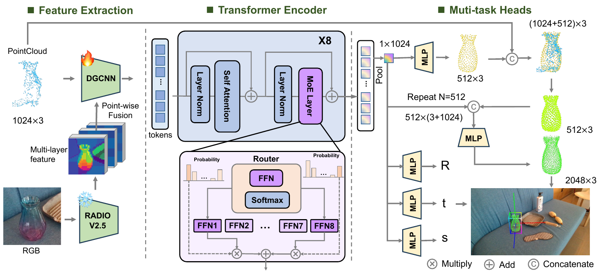
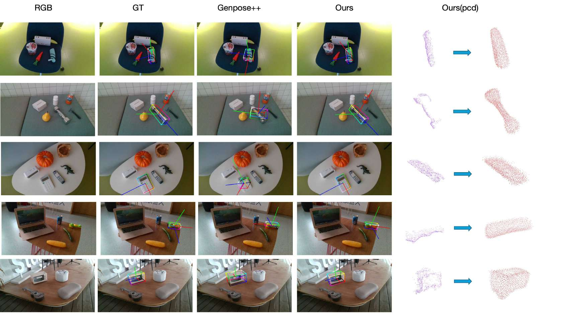
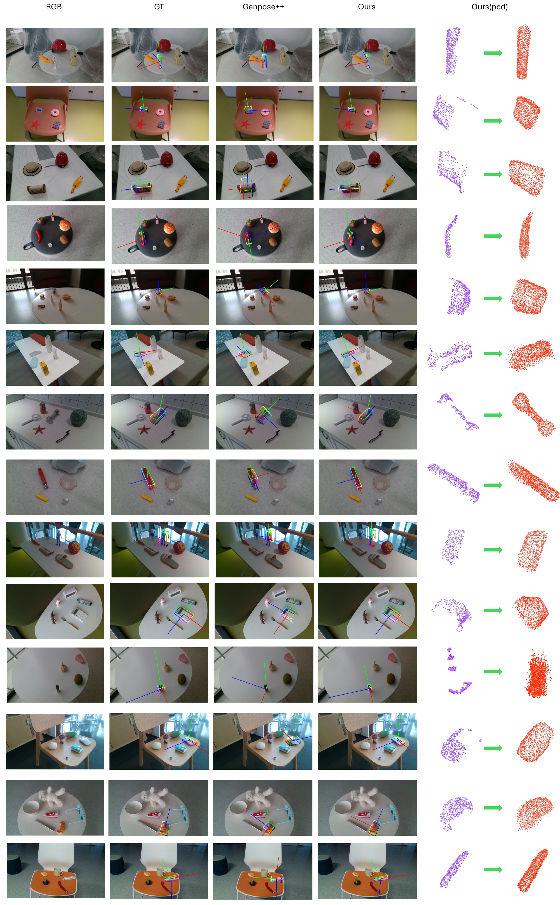
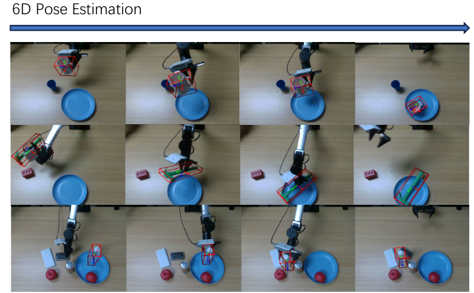

# F2G-Pose: Geometry-Aware Foundation Feature Lifting for Direct RGB-D Category-Level Object Pose Estimation

**TL;DR:** F2G-Pose estimates an object’s 6D pose, metric size, and completed 3D shape from a single segmented RGB-D observation in one forward pass.

F2G-Pose lifts visual foundation features onto observed 3D points. Inputs are an RGB image, aligned depth, camera intrinsics, and a foreground mask; no category label or object-specific CAD model is needed.

[Installation](docs/INSTALL.md) · [Demo & inference](docs/USAGE.md#interactive-demo) · [Training](docs/USAGE.md#training) · [Evaluation](docs/EVALUATION.md) · [Deployment](docs/DEPLOYMENT.md)



## How it works

1. **Lift appearance into 3D.** A frozen RADIO backbone supplies dense image features, which are projected onto the observed point cloud.
2. **Combine appearance and geometry.** DGCNN builds local geometric tokens; a Mixture-of-Experts Transformer captures object-level structure.
3. **Predict pose, size, and shape.** Parallel heads estimate the object-to-camera transform, metric dimensions, and a completed point cloud. Use pose-only mode when you only need pose and size.

The model is trained on synthetic SOPE data and evaluated on both SOPE and real-world ROPE data.

## Results in pictures



**Pose and shape on ROPE.** Columns show RGB, ground truth, GenPose++, F2G-Pose, and the observed-to-completed point cloud. These examples are from the paper.

<details>
<summary>More ROPE examples</summary>



</details>

### Robot manipulation

<p align="center">
  
</p>

The paper also demonstrates pose-guided pick-and-place with an ARX robot, a parallel-jaw gripper, and an RGB-D camera. Completed shapes provide geometry for collision checking.

## Try it

Follow [Installation](docs/INSTALL.md) to set up the environment, RADIO, and model weights. Then launch the interactive demo:

```bash
f2g-pose demo --checkpoint weights/f2g-pose.pt --port 7860
```

Open **http://127.0.0.1:7860**, upload RGB, depth, and a mask, then enter the camera intrinsics and depth units. The demo displays pose axes, a 3D box, and the completed shape, with JSON and PLY downloads. Optional [SAM prompting](docs/USAGE.md#interactive-demo) lets you select the object with clicks or a box.

For a ready-to-use real input, try the [bundled ROPE teapot sample](examples/rope/README.md). It includes aligned RGB, metric depth, a target mask, camera intrinsics, and a one-object evaluation manifest.

For Python applications:

```python
from f2g_pose import PoseEstimator

estimator = PoseEstimator("weights/f2g-pose.pt")
result = estimator.predict(rgb, depth, K, mask, depth_scale=0.001)

T_cam_obj = result["T_cam_obj"]       # 4×4 object-to-camera transform
size_m = result["size_m"]             # object dimensions in meters
points_cam = result["points_cam_m"]   # completed shape in camera coordinates
```

Here, `rgb`, `depth`, and `mask` are aligned NumPy arrays; `K` is a 3×3 matrix or `[fx, fy, cx, cy]`. Use `depth_scale=0.001` for millimeter depth or `1.0` for meters. See [input formats and coordinates](docs/USAGE.md#input-formats) for a complete example.

**Weights:** [download `f2g-pose.pt`](https://huggingface.co/J3rr1/F2G-Pose/resolve/main/f2g-pose.pt?download=true) (SHA-256 `bff06bd58a42fd805d8232f9ab7b4612b8eb833edf6b6cccd23e5040a8c9ca18`). RADIO is downloaded separately.

## Benchmark results

Full-test results for the provided model:

| Dataset | AUC25 ↑ | AUC50 ↑ | AUC75 ↑ | Mean rotation ↓ | Mean translation ↓ |
| --- | ---: | ---: | ---: | ---: | ---: |
| SOPE | 60.24 | 44.73 | 17.69 | 14.73° | 0.824 cm |
| ROPE | 46.75 | 28.19 | 6.17 | 26.99° | 1.181 cm |

AUC values are percentages. See [Evaluation](docs/EVALUATION.md) for VUS, evaluation settings, and reproduction commands.

On RTX 4090, batch-1 model inference runs at **36.6 FPS** with shape completion and **37.2 FPS** in pose-only mode. These FP32 measurements use 30 warmup and 200 synchronized iterations; preprocessing and SAM are excluded.

## Documentation

| Task | Guide |
| --- | --- |
| Set up CUDA extensions and weights | [Installation](docs/INSTALL.md) |
| Run the demo or predict on your own RGB-D data | [Usage](docs/USAGE.md) |
| Train, resume, or evaluate on SOPE / ROPE | [Training and evaluation commands](docs/USAGE.md#training) |
| Understand metrics and runtime | [Evaluation](docs/EVALUATION.md) |
| Run with Docker or prepare a Hugging Face Space | [Deployment](docs/DEPLOYMENT.md) |
| Check model inputs, outputs, and limitations | [Model card](docs/MODEL_CARD.md) |
| Inspect implementation checks | [Validation](docs/VALIDATION.md) |

## Acknowledgments and license

We thank the authors of RADIO, PoinTr / AdaPoinTr, PointNet++, Omni6DPose, GDR-Net, CenterNet, NOCS, SGPA, FS-Net, and Segment Anything for their code, datasets, and ideas.

F2G-Pose integration code uses [Apache-2.0](LICENSE). Third-party components retain their own licenses; see [THIRD_PARTY.md](THIRD_PARTY.md). RADIO is installed and downloaded separately under NVIDIA's terms.
